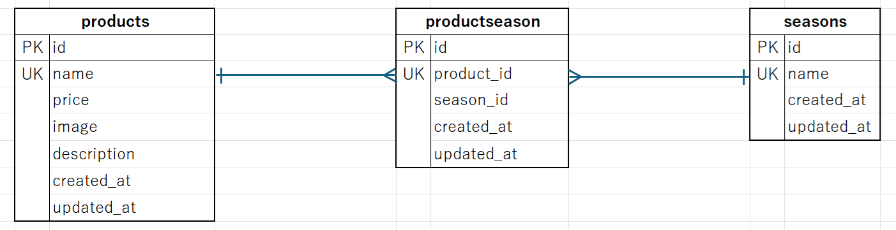

・アプリケーション名
fresh_form（もぎたて）

・環境構築

Docker ビルド
1,git clone git@github.com:akio0121/fresh_form.git
2,DockerDesktop アプリを起動する。
3,docker-compose up -d --build

Laravel 環境構築
1,docker-compose exec php bash
2,composer install
3,「.env.example」ファイルを 「.env」ファイルに命名を変更する。
4,php artisan key:generate
5,php artisan migrate
6,php artisan db:seed

・使用技術（実行環境）
PHP 8.3.12
MySQL 8.0.26
Laravel 8.83.8

・ER 図

・URL
開発環境 http://localhost/
phpMyAdmin http://localhost:8080/

[def]: ER-1.png